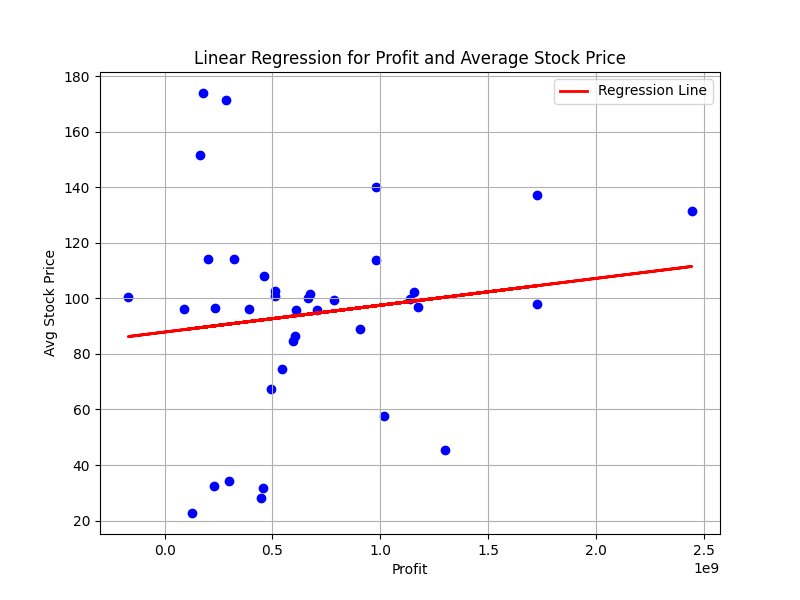
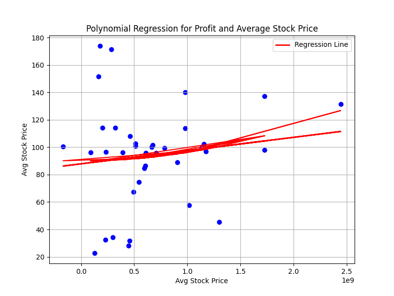

# disney-marvel-regression
I wanted to learn how to scrape Wikipedia and how to use Pandas to run a linear regression on a set of data. I decided to test Marvel movie profit as a predictor for average Disney stock price for the period between the given movie and the next.

## Methodology
First, scraper.py downloads, formats the table for Marvel movie profit on Wikipedia, then saves it as a csv. Then yfin.py downloads Disney stock prices and saves them to csv. Finally, dis_analysis.py computes the mean stock prices for the time periods between each film, makes a dataframe of those average prices with movie profits, runs a Pearson R test, runs a linear regression model, and runs a quadtratic regression model.

## Analysis
The point of the project was to better learn some Python modules. Disney is a huge company. Defining profit as only box office minus budget is not the best. There are so many reasons this analysis is oversimplistic and urealistic. I did not expect strong correlation between the variables. Indeed, the correlation is exceedingly low (correlation coefficient is 0.1390601). 

And the quadradic model is completely pointless. 

But, I gained some great experience!
